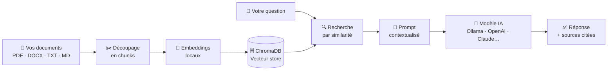

<div align="center">

# 💼 Local HR RAG Chatbot

### Posez des questions sur vos documents RH — en local, privé, sans connexion requise

[](https://www.python.org/)
[](https://streamlit.io/)
[](https://www.trychroma.com/)
[](LICENSE)
[](https://ollama.ai/)

**Déposez vos documents RH → Posez vos questions → Obtenez des réponses sourcées**

*Aucune donnée ne quitte votre machine. Aucun abonnement. Aucune clé API requise.*

</div>

---

## ⚡ Lancement rapide (après installation)

> Vous avez déjà installé l'app ? Un double-clic suffit pour relancer.

| Système | Fichier à double-cliquer | Ou en terminal |
|---|---|---|
| **macOS** | `run.command` | `bash run.command` |
| **Linux** | `run.sh` | `bash run.sh` |
| **Windows** | `run.bat` | double-clic |

Le script s'occupe de tout : vérifier le venv, démarrer Ollama, ouvrir le navigateur, lancer l'app.

> **Premier lancement ?** Le script installe l'environnement automatiquement — même comportement que `bash setup.sh`.

---

## 🎯 À quoi ça sert ?

Imaginez un assistant RH disponible 24h/24, capable de répondre instantanément à des questions comme :

> *"Combien de jours de congés ai-je droit après un mariage ?"*
> *"Quelles sont les règles du télétravail dans l'entreprise ?"*
> *"Comment fonctionne la période d'essai pour un CDI cadre ?"*

…en citant toujours la source exacte dans vos propres documents. **Sans jamais inventer.**

| ✅ Ce qu'il fait | ❌ Ce qu'il ne fait pas |
|---|---|
| Répond depuis VOS documents | Inventer des informations |
| Cite la source de chaque réponse | Envoyer vos données sur internet |
| Fonctionne 100% hors ligne | Accéder à des sources externes |
| Supporte PDF, DOCX, TXT, Markdown | Remplacer un juriste RH |

---

## 🧠 Comment ça marche ? (RAG en 3 étapes)

> **RAG = Retrieval-Augmented Generation** — une technique d'IA qui force le modèle à répondre *uniquement* depuis vos documents.



**Étape 1 — Indexation** : Vos documents sont découpés en petits extraits, convertis en vecteurs mathématiques et stockés localement.

**Étape 2 — Recherche** : Quand vous posez une question, le système cherche les extraits les plus pertinents dans la base vectorielle.

**Étape 3 — Génération** : Le modèle IA reçoit uniquement ces extraits comme contexte et génère une réponse sourcée. Il ne peut pas inventer.

---

## 🚀 Démarrage en 5 minutes

### Prérequis

Avant de commencer, vérifiez que vous avez :

- [ ] **Python 3.10+** — [télécharger ici](https://www.python.org/downloads/)
- [ ] **Git** — [télécharger ici](https://git-scm.com/)
- [ ] **Ollama** (recommandé pour le mode local) — [télécharger ici](https://ollama.ai/)

<details>
<summary>💡 Comment vérifier ma version de Python ?</summary>

```bash
python3 --version
```

Si vous voyez `Python 3.10.x` ou supérieur, vous êtes prêt.

</details>

---

### Étape 1 — Cloner le projet

```bash
git clone https://github.com/franznyer/local-hr-rag-chatbot.git
cd local-hr-rag-chatbot
```

### Étapes 2 & 3 — Environnement virtuel + dépendances

```bash
bash setup.sh
```

Ce script crée le venv, règle automatiquement le problème Homebrew macOS, installe les dépendances, et vérifie Ollama. Si le venv existe déjà, il le réutilise sans tout réinstaller.

> ⏳ La première exécution prend 2–5 minutes. C'est normal.

<details>
<summary>🪟 Windows ou installation manuelle</summary>

```bash
python3 -m venv .venv
```

macOS / Linux :
```bash
source .venv/bin/activate
```

Windows :
```bash
.venv\Scripts\activate
```

```bash
python -m pip install -r requirements.txt
```

</details>

### Étape 4 — Configurer

```bash
cp .env.example .env
```

Ouvrez le fichier `.env` dans votre éditeur et vérifiez que ces lignes correspondent à votre setup :

```env
AI_PROVIDER=ollama    # ou lmstudio, openai, claude, mistral
MODEL_NAME=llama3     # nom du modèle que vous utilisez
```

### Étape 5 — Télécharger un modèle Ollama

`setup.sh` s'en charge automatiquement. Si vous le faites manuellement, lancez **une seule** de ces commandes selon votre RAM disponible :

| RAM disponible | Commande | Taille |
|---|---|---|
| 4 Go | `ollama pull llama3.2` | ~2 Go |
| 8 Go | `ollama pull llama3.1` | ~4.7 Go |
| 16 Go | `ollama pull mistral` | ~4.1 Go |
| 32 Go+ | `ollama pull llama3.1:70b` | ~40 Go |

```bash
ollama pull llama3.2
```

> Si le téléchargement est interrompu (`Error: EOF`), relancez la même commande — Ollama reprend là où il s'est arrêté.

Puis dans `.env`, indiquez le modèle choisi :

```env
MODEL_NAME=llama3.2
```

**Démarrer le serveur Ollama :**

- Si vous utilisez l'**app Ollama Desktop**, elle démarre le serveur automatiquement — vous n'avez rien à faire.
- Sinon, dans un terminal séparé :

```bash
ollama serve
```

> Si vous voyez `address already in use`, c'est que le serveur tourne déjà. C'est normal.

### Étape 6 — Vérifier l'installation

```bash
python scripts/check_setup.py
```

Vous devriez voir tous les éléments en vert ✓. Si ce n'est pas le cas, suivez les instructions affichées.

### Étape 7 — Lancer l'application

```bash
streamlit run app.py
```

L'application s'ouvre automatiquement sur **http://localhost:8501** 🎉

---

## 🔌 Providers IA supportés

Vous pouvez brancher n'importe quel fournisseur IA sans changer le code — juste en modifiant `.env`.

| Provider | Mode | Confidentialité | Prérequis |
|---|---|---|---|
| 🦙 **Ollama** | 100% local | ⭐⭐⭐ Maximale | `ollama serve` + modèle pullé |
| 🎬 **LM Studio** | 100% local | ⭐⭐⭐ Maximale | Serveur local démarré |
| 🟢 **OpenAI** | Cloud | ⭐ Données envoyées | Clé API `OPENAI_API_KEY` |
| 🟠 **Claude** | Cloud | ⭐ Données envoyées | Clé API `ANTHROPIC_API_KEY` |
| 🔵 **Mistral** | Cloud | ⭐⭐ Hébergé en EU | Clé API `MISTRAL_API_KEY` |

<details>
<summary>⚙️ Configuration pour LM Studio</summary>

1. Téléchargez [LM Studio](https://lmstudio.ai/)
2. Chargez un modèle GGUF dans la bibliothèque
3. Allez dans l'onglet **"Local Server"** et cliquez **Start**
4. Dans `.env` :

```env
AI_PROVIDER=lmstudio
MODEL_NAME=lmstudio-community/Meta-Llama-3-8B-Instruct-GGUF
LMSTUDIO_BASE_URL=http://localhost:1234/v1
```

</details>

<details>
<summary>⚙️ Configuration pour OpenAI</summary>

```bash
pip install openai
```

Dans `.env` :

```env
AI_PROVIDER=openai
MODEL_NAME=gpt-4o
OPENAI_API_KEY=sk-...votre-clé...
```

</details>

<details>
<summary>⚙️ Configuration pour Claude (Anthropic)</summary>

```bash
pip install anthropic
```

Dans `.env` :

```env
AI_PROVIDER=claude
MODEL_NAME=claude-sonnet-4-6
ANTHROPIC_API_KEY=sk-ant-...votre-clé...
```

</details>

---

## 📂 Ajouter vos propres documents

Déposez vos fichiers dans le dossier `documents/` :

```
documents/
├── reglement_interieur.pdf
├── politique_conges.docx
├── accord_teletravail.pdf
└── guide_onboarding.md
```

**Formats supportés :** PDF · DOCX · TXT · Markdown

Au prochain lancement (ou en cliquant **🔄 Réindexer** dans la sidebar), vos documents seront automatiquement analysés et indexés.

> 🔒 **Vos documents ne quittent jamais votre machine.** L'indexation se fait entièrement en local.

---

## 🏗️ Architecture du projet

```
local-hr-rag-chatbot/
│
├── 📱 app.py                    # Interface Streamlit (point d'entrée)
├── 📋 requirements.txt          # Dépendances Python
├── ⚙️  .env.example              # Modèle de configuration
├── 🔍 scripts/check_setup.py   # Script de diagnostic
│
├── 📁 documents/                # ← Vos documents RH ici
├── 🗄️  vectorstore/              # Base vectorielle (générée automatiquement)
│
└── 📦 src/
    ├── config.py                # Configuration centralisée
    ├── document_loader.py       # Lecture PDF/DOCX/TXT/MD
    ├── text_splitter.py         # Découpage en chunks
    ├── embeddings.py            # Modèle d'embedding local
    ├── vector_store.py          # Interface ChromaDB
    ├── rag_pipeline.py          # Orchestration RAG
    ├── prompts.py               # Prompt anti-hallucination
    │
    └── providers/               # Abstraction fournisseurs IA
        ├── base.py              # Interface commune (ABC)
        ├── ollama_provider.py
        ├── lmstudio_provider.py
        ├── openai_provider.py
        ├── claude_provider.py
        └── mistral_provider.py
```

### Ajouter un nouveau provider

```python
# src/providers/mon_provider.py
from src.providers.base import BaseProvider, Message, ProviderResponse

class MonProvider(BaseProvider):
    provider_name = "mon_provider"

    def complete(self, messages, **kwargs) -> ProviderResponse:
        # Votre logique ici
        ...

    def health_check(self) -> bool:
        # Vérifier que le service répond
        ...
```

Ensuite, enregistrez-le dans `src/rag_pipeline.py` → `_build_provider()` et ajoutez l'option dans `app.py`.

---

## ⚙️ Configuration complète (`.env`)

| Variable | Défaut | Description |
|---|---|---|
| `AI_PROVIDER` | `ollama` | Fournisseur actif |
| `MODEL_NAME` | `llama3` | Nom du modèle |
| `EMBEDDING_MODEL` | `all-MiniLM-L6-v2` | Modèle d'embedding local (~90 Mo) |
| `CHUNK_SIZE` | `512` | Taille des chunks (en mots) |
| `CHUNK_OVERLAP` | `64` | Chevauchement entre chunks |
| `TOP_K_RESULTS` | `4` | Nombre de chunks récupérés par requête |
| `MIN_RELEVANCE_SCORE` | `0.3` | Score de similarité minimum (0 à 1) |
| `OLLAMA_BASE_URL` | `http://localhost:11434` | Endpoint Ollama |
| `LMSTUDIO_BASE_URL` | `http://localhost:1234/v1` | Endpoint LM Studio |

---

## 🐛 Dépannage

<details>
<summary>🍺 Erreur "externally-managed-environment" sur macOS (Homebrew)</summary>

Cette erreur apparaît quand Python est installé via Homebrew. Même après `source .venv/bin/activate`, pip peut la déclencher.

**Solution rapide :**

```bash
# Utilisez le script fourni (recommandé)
bash setup.sh
```

**Ou manuellement :**

```bash
python3 -m venv .venv
# Supprimer le marqueur Homebrew dans le venv (sans danger)
find .venv/lib -name "EXTERNALLY-MANAGED" -delete
source .venv/bin/activate
python -m pip install -r requirements.txt
```

**Pourquoi ?** Homebrew propage un fichier `EXTERNALLY-MANAGED` dans les venvs qu'il crée. Sa suppression est sans risque : elle n'affecte que ce venv isolé, pas votre installation Python système.

</details>

<details>
<summary>🦙 Problèmes avec Ollama</summary>

| Erreur | Solution |
|---|---|
| `Connection refused` | Ouvrez l'app Ollama Desktop, ou lancez `ollama serve` |
| `address already in use` | Serveur déjà actif — pas de problème, continuez |
| `model 'X' not found` | Lancez `ollama pull X` |
| `Error: EOF` pendant le pull | Connexion interrompue — relancez `ollama pull X`, le téléchargement reprend |
| Réponse très lente | Modèle trop grand pour votre RAM — essayez `ollama pull llama3.2` |
| `ollama: command not found` | [Installez Ollama](https://ollama.ai) |

</details>

<details>
<summary>🎬 Problèmes avec LM Studio</summary>

| Erreur | Solution |
|---|---|
| `Connection refused` | Ouvrez LM Studio → "Local Server" → **Start** |
| Pas de modèle chargé | Chargez un modèle GGUF avant de démarrer le serveur |
| Port différent | Modifiez `LMSTUDIO_BASE_URL` dans `.env` |

</details>

<details>
<summary>☁️ Problèmes avec les providers cloud</summary>

| Erreur | Solution |
|---|---|
| `AuthenticationError` | Vérifiez votre clé API dans `.env` |
| `ModuleNotFoundError` | `pip install openai` / `pip install anthropic` / `pip install mistralai` |

</details>

<details>
<summary>📄 Problèmes avec les documents</summary>

| Symptôme | Solution |
|---|---|
| "Aucun document trouvé" | Vérifiez que des fichiers sont dans `/documents` |
| PDF sans réponse | Certains PDF sont des images scannées (OCR non supporté) |
| Réponse hors-sujet | Cliquez **🔄 Réindexer** dans la sidebar |

</details>

---

## 🗺️ Roadmap

- [x] Pipeline RAG complet (ingestion, embedding, retrieval, génération)
- [x] Support multi-provider (Ollama, LM Studio, OpenAI, Claude, Mistral)
- [x] Interface Streamlit avec sources et indice de confiance
- [x] Détection automatique des nouveaux documents
- [ ] Upload de documents directement dans l'UI
- [ ] Packaging Docker (une commande pour tout démarrer)
- [ ] Support multilingue
- [ ] API REST pour intégration SaaS
- [ ] Re-ranking LLM des résultats

---

## 🤝 Contribuer

Les contributions sont les bienvenues ! Consultez [CONTRIBUTING.md](CONTRIBUTING.md) pour commencer.

---

## 📄 Licence

Ce projet est sous licence [MIT](LICENSE) — libre d'utilisation, modification et distribution.

---

<div align="center">

**Construit avec** Python · ChromaDB · sentence-transformers · Streamlit

*Si ce projet vous a été utile, ⭐ une étoile sur GitHub fait toujours plaisir !*

</div>
